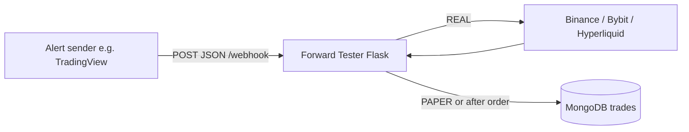

# TRW Forward Tester

Flask webhook service for forwarding TradingView-style JSON alerts to Binance, Bybit, or Hyperliquid and storing every event in MongoDB. A separate Streamlit dashboard reads the same `trading.trades` collection for reporting.

This repo does not decide when to trade. Strategy logic, entries, exits, sizing, and whether an alert is paper or live all come from Pine Script or another webhook sender. This service validates the request, normalizes quantity, routes the order, and records the result.

---

## Setup order

1. Install Python dependencies and create `.env`.
2. Fill in environment variables.
3. Configure MongoDB and set `MONGO_URI`.
4. Choose how you want to run the webhook service: local debugging or Render hosting.
5. Expose the webhook server on a public `http://` or `https://` endpoint.
6. Configure TradingView or another sender to `POST` valid JSON to `/webhook`.
7. Run the Flask app.
8. Optionally run the Streamlit dashboard.

---

## Install

### Windows

```powershell
python -m venv .venv
.venv\Scripts\activate
pip install -r requirements.txt
copy .env.sample .env
```

### macOS and Linux

```bash
python3 -m venv .venv
source .venv/bin/activate
pip install -r requirements.txt
cp .env.sample .env
```

---

## Environment variables

Edit `.env` before running anything.

| Variable | Used for |
|----------|-----------|
| `API_KEY` | Binance USDT-M and Bybit credentials |
| `API_SECRET` | Secret paired with `API_KEY` |
| `WHITELISTED_IPS` | Comma-separated IPs allowed to call `POST /webhook` |
| `WEBHOOK_SECRET` | Optional shared secret. If set, webhook JSON must include a matching `passphrase` field |
| `MONGO_URI` | MongoDB connection string |
| `HYPERLIQUID_WALLET_ADDRESS` | Hyperliquid wallet address |
| `HYPERLIQUID_PRIVATE_KEY` | Hyperliquid private key for signed order actions |
| `HYPERLIQUID_SLIPPAGE` | Optional default slippage for Hyperliquid market orders, for example `0.01` |

Notes:

- Binance and Bybit share the same `API_KEY` and `API_SECRET` variable names in this app.
- If `WEBHOOK_SECRET` is set in the environment, every webhook request must include a top-level `passphrase` field that matches it. If left empty, this check is bypassed.
- Only the credentials for the exchange named in a `REAL` webhook need to be valid for that request flow.
- Hyperliquid public info calls use the wallet address only; signed order actions also need the private key.

---

## MongoDB setup

Both the Flask app and the Streamlit dashboard use PyMongo with one `MONGO_URI`. You do not need to create the database or collection manually. The first successful insert creates:

| What | Value |
|------|--------|
| Database name | `trading` |
| Collection name | `trades` |
| Driver | `pymongo` via `MongoClient(os.getenv('MONGO_URI'))` |

Official MongoDB references:

- [Connect to an Atlas cluster](https://www.mongodb.com/docs/atlas/tutorial/connect-to-your-cluster/)
- [Connect via client libraries / drivers](https://www.mongodb.com/docs/atlas/driver-connection/)
- [Get connection string](https://www.mongodb.com/docs/guides/atlas/connection-string/)
- [Add entries to the IP access list](https://www.mongodb.com/docs/atlas/security/ip-access-list/)

### Atlas setup

1. Create a deployment in [MongoDB Atlas](https://www.mongodb.com/cloud/atlas).
2. Open the cluster and click **Connect**.
3. Choose **Connect your application**.
4. Add the correct source IPs to the Atlas **IP access list**. For hosted deployments, add the server or platform egress IPs, not just your laptop.
5. Create a MongoDB database user under **Database Access** if you do not already have one.
6. Copy the Python connection string, usually an `mongodb+srv://...` URI.
7. Replace `<password>` with the database user password. Percent-encode special characters such as `@`, `:`, and `/` if needed.
8. Put the finished URI into `MONGO_URI` in `.env`.

Notes:

- Atlas requires TLS.
- This app selects `mongo_client.trading` in code, so it does not rely on the database name embedded in the URI path.
- Under strict outbound firewall rules, Atlas expects access to TCP ports `27015` to `27017` on cluster hostnames.

### Atlas allowlist for Render

If the app runs on Render, Atlas must allow Render's outbound addresses, not only your local machine.

Where to find them in Render:

1. Open the Render Dashboard.
2. Open your specific web service.
3. Open **Connect** in the upper-right corner.
4. Switch to the **Outbound** tab.
5. Copy every listed outbound IP address or CIDR range.

Important:

- Add **all** listed outbound entries to Atlas. Render can use any of them for a connection.
- Atlas accepts CIDR ranges in the IP access list, so paste the ranges exactly as Render shows them.
- If you test the same MongoDB URI from your laptop too, your current public IP must also be allowlisted separately.
- Render changed outbound networking in late 2025 to include regional IP ranges, so older screenshots or guides that show only individual IPs can be incomplete.
- If your workspace was created before January 23, 2022 and the service runs in Oregon, Render documents that fixed outbound IPs might not be available for that service.

Quick verification flow:

1. In Atlas, temporarily add `0.0.0.0/0`.
2. Test the webhook once.
3. If MongoDB starts working immediately, the problem was the Atlas IP access list.
4. Remove `0.0.0.0/0` and replace it with your Render outbound entries plus any local testing IPs you need.

### Local MongoDB options

- MongoDB Community Edition or Docker, for example `mongodb://localhost:27017/`
- Atlas CLI local deployment if you prefer MongoDB's documented Docker-based local flow

### Verify MongoDB

- `mongosh "<your MONGO_URI>"`, then `use trading` and `db.trades.find().limit(1)`
- MongoDB Compass with the same URI, then open `trading` -> `trades`

### MongoDB troubleshooting

| Issue | What to check |
|--------|----------------|
| Cannot connect or timeouts | Wrong URI, local MongoDB not running, blocked outbound access, or a local or Render source IP missing from the Atlas IP access list |
| `SSL handshake failed` against `*.mongodb.net` | Often still an Atlas allowlist problem. Confirm Atlas includes all Render **Connect -> Outbound** entries and any local public IP used for testing |
| Authentication failed | Wrong database user, wrong password, or password not URL-encoded |
| Dashboard says there are no trades | Normal until the webhook has inserted at least one document |

---

## Choose how to run the service

You have two practical paths:

- **Local debugging**: run the Flask dev server on your machine, inspect logs quickly, and use a tunnel if you want TradingView to reach it.
- **Render hosting**: deploy the Flask app as a managed public web service with HTTPS, auto-deploys, and environment variables in the Render dashboard.

### Path A: local debugging

Use this when you are developing, debugging payloads, or testing exchange behavior manually.

What to do:

1. Run the Flask app locally with `python app.py`.
2. Send test requests directly to `http://localhost:5000/webhook` with `curl`, Postman, or pytest.
3. If you want TradingView to hit your local machine, expose it with a tunnel such as ngrok or Cloudflare Tunnel and point TradingView to the tunnel URL.

What to be aware of:

- TradingView will not send to arbitrary ports; it only accepts webhook URLs on ports `80` and `443`.
- `localhost` is never reachable from TradingView directly.
- If a tunnel or reverse proxy sits in front of your app, `WHITELISTED_IPS` must allow the source IP your Flask app actually sees.
- The Flask dev server is for development, not production.

### Path B: optional hosting on Render

Use this when you want a managed public HTTPS endpoint without running your own VPS or reverse proxy.

Render setup, based on the current official Flask and web-service docs:

- [Deploy a Flask App on Render](https://render.com/docs/deploy-flask)
- [Deploy for Free](https://render.com/docs/free)
- [Outbound IP Addresses](https://render.com/docs/outbound-ip-addresses)

1. Push the repo to GitHub, GitLab, or Bitbucket.
2. In the Render dashboard, create **New -> Web Service** and connect the repo.
3. Use these settings:

   | Setting | Value |
   |---------|-------|
   | Runtime | `Python 3` |
   | Build Command | `pip install -r requirements.txt` |
   | Start Command | `gunicorn app:app` |

4. In **Environment**, add the same variables you use locally:
   - `API_KEY`
   - `API_SECRET`
   - `WHITELISTED_IPS`
   - `WEBHOOK_SECRET`
   - `MONGO_URI`
   - `HYPERLIQUID_WALLET_ADDRESS`
   - `HYPERLIQUID_PRIVATE_KEY`
   - `HYPERLIQUID_SLIPPAGE`
5. Deploy the service and wait for the first build to finish.
6. Use the generated `https://<service>.onrender.com/webhook` URL in TradingView, or attach a custom domain later.

What to be aware of on Render:

- `gunicorn app:app` matches the existing `Procfile` and is the recommended Flask start command in Render's current docs.
- Render terminates public HTTPS at the edge and forwards traffic to your service over HTTP. You do not need to manage TLS certificates yourself for the default `onrender.com` URL.
- Render web services must bind on `0.0.0.0`; Render expects the public HTTP server on its configured port and defaults to `PORT=10000`. Using Gunicorn through Render's Python runtime handles that for you.
- Put all secrets in Render environment variables, not in the repo.
- If MongoDB Atlas uses an IP allowlist, open the service's **Connect -> Outbound** panel in Render and add every listed outbound IP or CIDR range to Atlas. Render can use any listed entry.
- Render's filesystem is ephemeral. That is fine for this app because trades belong in MongoDB, but do not rely on local files for persistence.

Important plan choice:

- A **Render Free web service is not a good fit for live TradingView webhooks**. Render's current docs say Free services spin down after 15 minutes without inbound traffic and can take about one minute to spin back up. TradingView cancels a webhook if the receiver takes longer than about 3 seconds. That means idle cold starts can cause missed alerts.
- Inference from those docs: use local-plus-tunnel only for development, and use a Render paid web service if you want Render to receive TradingView webhooks reliably.

### Local debugging vs Render hosting

| Topic | Local debugging | Render hosting |
|------|------------------|----------------|
| Best for | Development and payload debugging | Public hosted webhook endpoint |
| Public URL | Needs a tunnel or your own reverse proxy | Built in via `onrender.com` or custom domain |
| Server | Flask dev server | Gunicorn on Render |
| HTTPS | Your tunnel or proxy handles it | Render handles it |
| Secrets | `.env` on your machine | Render environment variables |
| MongoDB Atlas allowlist | Your local or tunnel egress IP | Every IP or CIDR range shown in Render **Connect -> Outbound** |
| TradingView reliability | Good for manual tests, not ideal for always-on usage | Good on paid instances; risky on Free because of spin-down |
| Filesystem persistence | Your local disk | Ephemeral unless you add external storage |

---

## Webhook sender setup

This app expects a JSON `POST` to `/webhook`. TradingView is the common sender, but any system that sends the same JSON shape works.

### TradingView requirements

1. The webhook URL must be publicly reachable. `localhost` is not enough unless you expose it with a tunnel.
2. TradingView only sends webhooks to port `80` or `443`. It rejects URLs that include ports such as `:5000`.
3. TradingView webhooks require [2FA](https://www.tradingview.com/support/solutions/43000572460-how-to-configure-2fa/).
4. TradingView expects your server to respond in about 3 seconds.
5. TradingView webhooks use IPv4 only.

### Allowlist sender IPs

Requests are rejected unless the client IP appears in `WHITELISTED_IPS`.

TradingView currently documents these webhook source IPs:

- `52.89.214.238`
- `34.212.75.30`
- `54.218.53.128`
- `52.32.178.7`

Set `WHITELISTED_IPS` to a comma-separated list containing those IPs and any additional senders or proxies you use. Re-check TradingView's current list here if needed:

- [TradingView webhook docs](https://www.tradingview.com/support/solutions/43000529348-how-to-configure-webhook-alerts/)

### Configure a TradingView alert

1. Open the chart running your Pine strategy.
2. Create or edit an alert.
3. Choose the correct strategy condition.
4. Enable **Webhook URL** and point it to:

   `https://your-domain.com/webhook`

5. Paste a valid JSON message body. Start from `webhook_format.json`.
6. Use TradingView placeholders where needed, for example:
   - `{{ticker}}`
   - `{{interval}}`
   - `{{timenow}}`
   - `{{time}}`
   - `{{strategy.order.action}}`
   - `{{strategy.order.contracts}}`
   - `{{strategy.position_size}}`
7. Set literal values such as `order_type` and `exchange`, or expose them from Pine if you prefer.
8. If you configured `WEBHOOK_SECRET`, set `passphrase` to that same literal value. If not, you can omit it.
9. Save the alert and watch the TradingView alert log if delivery fails.

Keep the message as strict JSON. If the body is not valid JSON, Flask returns `400`.

### Webhook payload

Use `webhook_format.json` as the template. Important fields:

| Field | Purpose |
|--------|---------|
| `order_type` | `PAPER` or `REAL` |
| `passphrase` | Must match `WEBHOOK_SECRET` (if configured) |
| `exchange` | For `REAL` only: `BINANCE`, `BYBIT`, or `HYPERLIQUID` |
| `ticker` | Symbol, normalized inside the app |
| `leverage` | Passed to exchange helpers where supported |
| `strategy` / `bar` / `strategyName` | Stored with the trade record |

Notes:

- `exchange` is chosen per request. There is no default venue in config.
- If `order_type` is omitted, the app treats the event as `PAPER`.
- If `order_type` is `REAL`, missing or unsupported `exchange` fails the request.

### TradingView troubleshooting

| Symptom | What to check |
|--------|----------------|
| `403` from Forward Tester | Sender IP is not in `WHITELISTED_IPS` |
| `401` from Forward Tester | `passphrase` is missing or wrong (only when `WEBHOOK_SECRET` is set) |
| `400` invalid JSON | Alert body is malformed JSON |
| TradingView never reaches the server | Wrong port, firewall, reverse proxy, or bad URL |
| Timeouts | Flask app, exchange call, or MongoDB write is taking too long |

---

## Run the webhook server

### Local run

```bash
python app.py
```

The Flask app listens on `0.0.0.0:5000` with `debug=True`.

For TradingView, do not send alerts directly to `:5000`. Put a reverse proxy or load balancer in front of the app and serve the public endpoint on port `80` or `443`.

### Render run

On Render, do not start the service with `python app.py`. Use:

```bash
gunicorn app:app
```

That is already the command in `Procfile` and matches Render's current Flask deployment guide.

---

## Run the dashboard

From the repository root:

```bash
streamlit run dashboard/dashboard.py
```

The dashboard needs `MONGO_URI` and at least one trade in `trading.trades`.

---

## How requests are handled

1. A sender posts JSON to `POST /webhook`.
2. The client IP must be in `WHITELISTED_IPS` or the request gets `403`.
3. If `WEBHOOK_SECRET` is configured, the JSON `passphrase` must match it or the request gets `401`.
4. Invalid or empty JSON gets `400`.
5. Quantity rules from `config/settings.py` normalize the symbol, enforce minimum quantity, and apply decimal precision where configured.
6. If `order_type` is `PAPER`, no exchange call is made and the event is still saved to MongoDB.
7. If `order_type` is `REAL`, the app routes to `BINANCE`, `BYBIT`, or `HYPERLIQUID` and uses environment-based credentials for that venue.
8. The event is inserted into `trading.trades` with metadata, quantity, side, leverage, and `order_response`.



---

## Minimum quantity and precision

Edit `config/settings.py` if a symbol needs exchange-specific quantity handling.

- `minQtyDict`: symbol to minimum contracts
- `precisionDecimalDict`: symbol to decimal precision used for rounding

Keep Pine sizing aligned with those values so the final order size matches exchange constraints.

---

## Switching from paper to live

In the webhook JSON, change:

```json
"order_type": "PAPER"
```

to:

```json
"order_type": "REAL"
```

Then set `exchange` to the correct venue and make sure the matching credentials are configured in `.env`.

---

## Project layout

| Piece | Role |
|--------|------|
| `app.py` | Flask app, `/webhook`, execution routing, MongoDB writes |
| `exchanges/` | Exchange adapters for Binance, Bybit, and Hyperliquid |
| `config/settings.py` | Minimum quantity and precision settings |
| `webhook_format.json` | Example webhook payload |
| `dashboard/dashboard.py` | Streamlit reporting UI |

---

## Tests

```bash
python -m pytest
```

---

## Design split

- TradingView or Pine decides strategy logic, timing, sizing, paper vs live, and which `exchange` value to send.
- This repo handles IP allowlisting, request validation, quantity normalization, exchange execution, persistence, and optional dashboard reporting.
